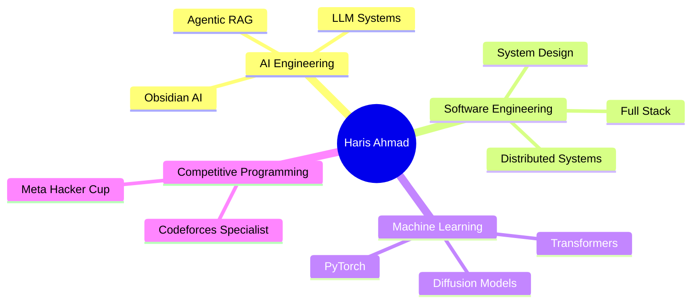

<div align="center">

# Hi, I'm Haris Ahmad


### Building AI systems, agentic workflows, and scalable software

[](https://haris-a11.github.io/terminal-portfolio/)
[](https://linkedin.com/in/haris-ahmad-iitp)
[](mailto:harisahmad200411@gmail.com)
[](https://drive.google.com/file/d/10iF1cb92SbmkhpqCf2QhdbeI-quvIe67/view)

</div>

---

## About Me

I'm a **B.Tech student in Electronics and Communication Engineering at IIT Patna** with a strong interest in **Software Engineering, AI Systems, Agentic Workflows, and Machine Learning**.

I enjoy building practical systems that combine modern software engineering with artificial intelligence. My interests span full-stack development, retrieval systems, LLM applications, deep learning, distributed systems, and infrastructure.

Rather than focusing only on models, I enjoy understanding how complete systems are designed, deployed, scaled, and maintained.

```bash
$ whoami

Haris Ahmad
━━━━━━━━━━━━━━━━━━━━━━━━━━━━━━━━━━

🎓 B.Tech ECE @ IIT Patna

$ current-focus

→ Building Agentic RAG Systems
→ Developing AI-powered Obsidian Plugins
→ Learning Diffusion Models
→ Studying Distributed Systems
→ Exploring Modern AI Architectures

$ interests

AI Engineering
Software Engineering
Machine Learning
System Design
Full-Stack Development
```

---

## Current Focus

### Agentic AI & LLM Systems

Building Agentic RAG architectures, retrieval pipelines, autonomous reasoning workflows, and AI-powered applications. Exploring agent design patterns, tool calling, MCP, and production-grade AI systems.

### Full-Stack Development

Developing modern web applications using Next.js, TypeScript, JavaScript, Node.js, MongoDB, PostgreSQL, and REST APIs. Focused on building scalable and maintainable software systems.

### Machine Learning & Research

Studying diffusion models, transformers, computer vision, deep learning architectures, and implementing research papers from scratch to gain first-principles understanding.

### Systems & Infrastructure

Working with Linux, Docker, self-hosted services, networking, Tailscale, Samba, FileBrowser, and modern deployment workflows.

---

## Tech Stack

<div align="center">


<br>


</div>

---

## GitHub Analytics
<div align="center">


</div>

---

## 🏆 Highlights



---

## Recognition

<div align="center">

<a href="https://codeforces.com/profile/Grim.Reaper">

</a>
<a href="https://www.facebook.com/codingcompetitions/hacker-cup">

</a>
<a href="https://cloud.layer5.io/user/ee4c7125-c146-48bb-a0ea-5042ccf8f820?tab=badges&badge=first-design">

</a>

</div>

---

## Featured Projects

<div align="center">

| Project                   | Description                                                                                                                                   | Tech Stack                     |
| ------------------------- | --------------------------------------------------------------------------------------------------------------------------------------------- | ------------------------------ |
| **FlashIt**               | Peer-to-peer file sharing platform built on WebRTC with direct browser-to-browser transfer and zero server-side file storage                  | Next.js, TypeScript, WebRTC    |
| **Obsidian AI Plugin**    | AI-powered knowledge management plugin integrating note generation, retrieval, embeddings, and intelligent workflows directly inside Obsidian | TypeScript, Obsidian API, LLMs |
| **Agentic RAG System**    | Modular retrieval-augmented generation system with autonomous reasoning, tool orchestration, and multi-step retrieval pipelines               | Python, LLMs, RAG              |
| **Smith Chart Simulator** | Interactive visualization platform for RF impedance matching and transmission line analysis                                                   | React, TypeScript              |
| **Super Tic Tac Toe**     | Strategic multiplayer game implementation with advanced game logic, move validation, and interactive gameplay                                 | JavaScript, React              |

</div>

---

## Learning Interests

- Agentic AI Systems
- Retrieval-Augmented Generation (RAG)
- LLM Engineering
- Diffusion Models
- Deep Learning
- Distributed Systems
- System Design
- Computer Networking
- Full-Stack Engineering
- Infrastructure & Self-Hosting

---

## Let's Connect

I'm always interested in discussing:

- Software Engineering
- AI Engineering
- Agentic Systems
- Machine Learning
- Full-Stack Development
- System Design
- Open Source Projects

<div align="center">

<a href="https://linkedin.com/in/haris-ahmad-iitp">

</a>

<a href="mailto:harisahmad200411@gmail.com">

</a>

<a href="https://drive.google.com/file/d/10iF1cb92SbmkhpqCf2QhdbeI-quvIe67/view">

</a>

<br><br>


</div>
